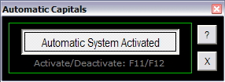



## Automatic Capitals

### Description

This program may be useful for those who like or need to write the first letter of every word in capitals; usually titles. "For Example, This Sentence..." The program automatically turns "CapsLock" on every time "Space" key is pressed, and deactivates it when any other key is pressed. Take a look!
 
### More Info
 

             |
---                |---
**Submitted On**   |2006-07-03 14:10:46
**By**             |[Diego Caivano](https://github.com/Planet-Source-Code/PSCIndex/blob/master/ByAuthor/diego-caivano.md)
**Level**          |Intermediate
**User Rating**    |4.3 (13 globes from 3 users)
**Compatibility**  |VB 5\.0, VB 6\.0
**Category**       |[String Manipulation](https://github.com/Planet-Source-Code/PSCIndex/blob/master/ByCategory/string-manipulation__1-5.md)
**World**          |[Visual Basic](https://github.com/Planet-Source-Code/PSCIndex/blob/master/ByWorld/visual-basic.md)
**Archive File**   |[Letra\_Capi200408732006\.zip](https://github.com/Planet-Source-Code/diego-caivano-automatic-capitals__1-63697/archive/master.zip)

